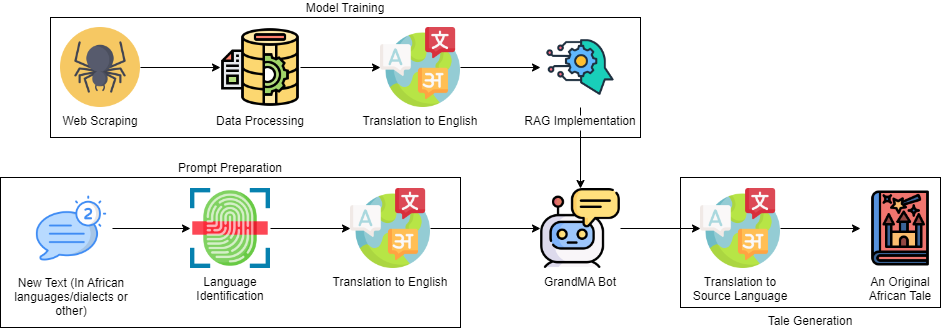

# GrandMaBOT

## Motivations

"In Africa, when an old man dies, a library burns," said Senegalese writer Amadou Hampâté-Bâ. This quote perfectly illustrates the importance of elders in preserving the cultural heritage of the continent and passing down knowledge. Given the fleeting nature of life, it is crucial for each of us to consider ways to preserve these heritage elements that are part of our DNA.

Today, with the development of AI and the emergence of LLMs, it is possible to contribute to this endeavor. The goal of our project is precisely in this direction. We aim to leverage the power of such technologies to preserve African culture through tales.

More specifically, our solution, "GrandMaBOT" is based on a collection of tales extracted from various sources and different African countries, reflecting each country's folklore. The goal is to draw inspiration from these tales to generate custom-made original stories that respect African traditions and customs.

Given the scarcity of solutions that include African languages and the need to democratize AI in our continent, we wanted to make this solution multilingual to facilitate its use by people who do not necessarily understand foreign languages. To this end, prompts can be written in Wolof, Moroccan Arabic, Swahili, Bambara, etc., and receive text in these languages in return.

## Architecture

Our architecture is structured as follows:
1. **Scraping and monitoring tales** from multiple sources (PDF, HTML, raw data, etc.) and various countries (Mali, Morocco, Algeria, etc.).
2. **Processing and structuring this data** (grouping by tale, country, language, etc.).
3. **Translating non-English data into English**.
4. **Implementing a RAG architecture using Falcon**.
5. **Fire!** (Conversation with GrandMaBOT).



## Example
Here is a prompt in Bambara, a language spoken in Mali:
```sh
Prompt : Aw ye maana surun dɔ fɔ n ye (kumasen 5 ka caya) waraba ni wulu dɔ kan
Tale : A ko: Waati dɔ, jara dɔ tun be Afiriki jamana na min tɔgɔ ko Sikar. A tun ka fari ani a tun be se ka koo dɔw kɛ. A tun be se ka mɔgɔw bali k'a ka bɛɛn sigi n'a ye. Loon dɔ, k'a to a tagatɔ a ka yɔrɔ kɔlɔsi, a ye wulu dɔ ye. Wuluw tun be siran a ɲɛ. Nka, a hinɛ donna a la, a y'a latigɛ k'a ta k'a kɛ a ka derekeba ye. Wulu nin tɔgɔ ko Timmy. K'a ta o loon na, u kɛra teriw ye. Sikar tun be to ka Timmy kalan a ka dumuni ɲini ani k'a dɛmɛ. U tun be yaala ɲɔgɔn fɛ kongokolon kɔnɔ, ka kongosogow faga ani ka kongosogo farimanw faga. U ka kokɛcogow tun tɛ kelen ye hali dɔɔni.
```

Here is a prompt in French:
```sh
Prompt : Raconte moi l'histoire d'une jeune marocaine partie en voyage avec sa maman
Tale : L'histoire 1: Il était une fois au Maroc, une jeune fille nommée Lila qui vivait avec sa mère. Ils étaient très proches et faisaient toujours des choses ensemble. Un jour, ils ont décidé de faire un voyage en voiture à travers la campagne du Maroc. Alors qu'ils conduisaient le long des routes sinueuses, Lila ne pouvait s'empêcher de se sentir excitée par tous les nouveaux endroits qu'elle verrait. L'histoire 2: Lila n'avait jamais fait un si long trajet en voiture auparavant et était ravie à l'idée de voir autant de nouveaux paysages. Elle avait l'impression que ce serait une aventure dont ils se souviendraient tous les deux pour toujours.

```

## About ToumAI Analytics

[ToumAI Analytics](https://www.toum.ai/) supports ventures willing to better understand their stakeholders no matter the language they use and improve their local impact across the EMEA region. 
​
We believe in the power of language and cultural diversity to connect and enrich our world. Our commitment to understanding and embracing dialects is at the heart of our approach. We recognize that every dialect represents a unique cultural identity and perspective.
 
By integrating this understanding into our voice solutions & analytics technology, we're not just enhancing communication – we're fostering deeper, more meaningful connections.
 
Our dedication to linguistic inclusivity is more than a feature; it's our promise to ensure everyone feels heard and valued. We're paving the way for a future where businesses thrive on diversity and inclusivity, creating a more connected and sustainable world for all.
​
Welcome to a place where every voice matters.

🏅 We are winners of the Finance For Tomorrow challenge in the Diversity and Inclusion category.
